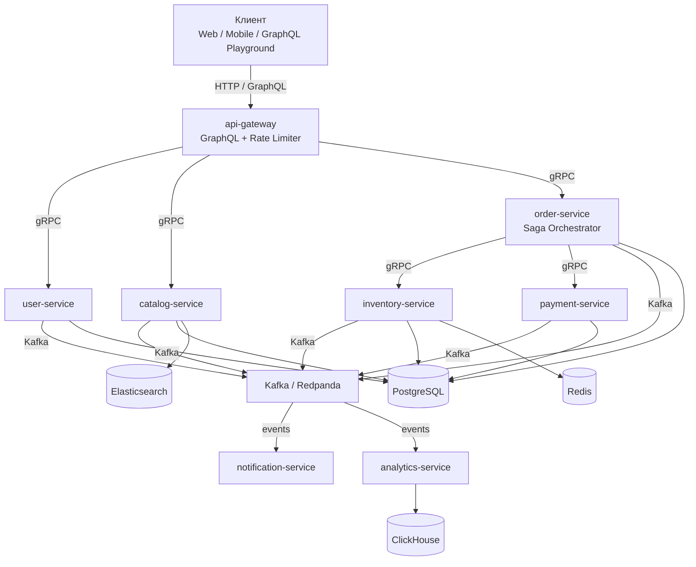

# go-ozon-marketplace

[](https://github.com/ekhodzitsky/go-ozon-marketplace/actions)
[](https://golang.org)
[](https://github.com/ekhodzitsky/go-ozon-marketplace/releases)
[](LICENSE)

Микросервисный e-commerce backend на Go — pet-проект для портфолио.

## Что это

Полноценный маркетплейс из 8 микросервисов с распределёнными транзакциями, CQRS, Saga, Transactional Outbox и полным стеком observability.

## Архитектура



### Микросервисы

| Сервис | Порт | Назначение |
|--------|------|------------|
| api-gateway | 8080 | GraphQL gateway, rate limiting, access-log, `/metrics` |
| user-service | 50051 | Регистрация, аутентификация (JWT с ролями) |
| catalog-service | 50052 | Каталог товаров, поиск (PG + ES), transactional outbox |
| inventory-service | 50053 | Управление остатками, ledger резерваций, Redis cache |
| payment-service | 50054 | Обработка платежей, атомарные транзакции, refunds |
| order-service | 50055 | Заказы, Saga Orchestrator, Outbox, Kafka publisher |
| notification-service | 50056 | Уведомления (service-only RPC) |
| analytics-service | 50057 | Аналитика в ClickHouse (партиционирование, ZSTD, TTL) |

### Ключевые паттерны

| Паттерн | Где | Зачем |
|---------|-----|-------|
| **Saga Orchestrator** | order-service | Управляет распределённой транзакцией заказа: резерв → оплата → подтверждение. При ошибке — компенсация (отмена резерва, возврат). |
| **Transactional Outbox** | order-service, catalog-service | Гарантирует доставку событий в Kafka без 2PC: сначала пишем в БД, потом релей отправляет в Kafka. |
| **CQRS** | catalog-service | Записи в PostgreSQL, поиск в Elasticsearch. Синхронизация через Kafka. |
| **mTLS** | Все сервисы | Взаимная TLS-аутентификация между микросервисами. |
| **Rate Limiting** | api-gateway | Redis-backed sliding window, защита от перегрузки. |
| **Circuit Breaker** | api-gateway → downstream | Предотвращает каскадные отказы при деградации сервисов. |

## Технологии

- **Go 1.26**, gRPC, GraphQL (gqlgen)
- **PostgreSQL 16**, Redis 7, ClickHouse, Elasticsearch
- **Kafka** (Redpanda), Transactional Outbox, Saga Orchestrator
- **Prometheus**, Grafana, **OpenTelemetry** → OTLP
- **mTLS** между сервисами
- **Kubernetes**, Helm, GitHub Actions CI/CD

## Быстрый старт

```bash
# 1. Поднять инфраструктуру
make up

# 2. Собрать и запустить сервисы (в отдельных терминалах)
cd services/api-gateway && go run ./cmd/...
cd services/order-service && go run ./cmd/...
# ... и так для остальных

# 3. Открыть GraphQL Playground
open http://localhost:8080
```

Подробнее — в [docs/QUICKSTART.md](docs/QUICKSTART.md).

## Тесты

```bash
# Unit + integration (testcontainers)
make test

# E2E (требуется Docker)
go test -tags=e2e ./tests/e2e/...

# Сборка всех модулей
make build
```

## Структура

```
├── api/                # Protobuf + generated gRPC/GraphQL
├── pkg/                # Shared packages (middleware, logger, metrics, tracing)
├── services/           # 8 микросервисов
├── infra/              # Docker Compose, Helm charts, monitoring
├── tests/              # Integration и E2E тесты (testcontainers)
└── docs/               # Документация, ADR, схемы
```

## Документация

- [Архитектура](docs/ARCHITECTURE.md) — схемы, потоки данных, взаимодействие сервисов
- [Быстрый старт](docs/QUICKSTART.md) — пошаговый сценарий: регистрация → товар → заказ
- [API](docs/API.md) — GraphQL и gRPC контракты
- [Развёртывание](docs/DEPLOYMENT.md) — Docker Compose, Kubernetes, Helm
- [Безопасность](docs/SECURITY.md) — JWT, роли, mTLS, rate limiting
- [Дизайн-документ](docs/design.md) — полный design doc с ADR

## CI/CD

GitHub Actions:
- **lint** (`golangci-lint`)
- **proto** (`buf lint`, `buf breaking`)
- **govulncheck**
- **test** (race, coverage gate 60%, итерация по `go.work` модулям)
- **build** (Docker images для всех сервисов)
- **helm** (lint + template validate)

Все Actions запиннены по SHA.

## Лицензия

MIT
