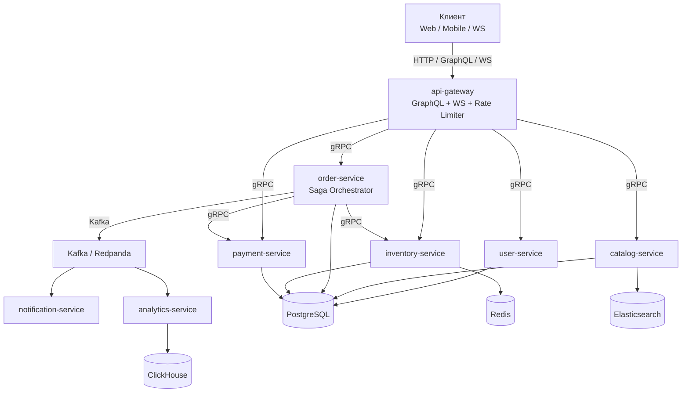

# go-ozon-marketplace

[](https://github.com/ekhodzitsky/go-ozon-marketplace/actions)
[](https://golang.org)
[](https://github.com/ekhodzitsky/go-ozon-marketplace/releases)
[](LICENSE)

Production-grade микросервисный e-commerce backend на Go — pet-проект для портфолио.

## Architecture Overview

Маркетплейс из 8 микросервисов с распределёнными транзакциями (Saga Orchestrator), Transactional Outbox, CQRS через Elasticsearch, real-time WebSocket, feature flags, A/B тестированием, observability, security hardening, chaos engineering и GitOps деплоем в Kubernetes.



## 🚀 Быстрый старт

```bash
# 1. Поднять всё в Docker Compose
make dev-up

# 2. Заполнить тестовыми данными
make dev-seed

# 3. Открыть GraphQL Playground
open http://localhost:8080
```

## 🛠️ Технологический стек

| Категория | Технологии |
|-----------|-----------|
| **Язык / Runtime** | Go 1.26 |
| **API** | gRPC, GraphQL (gqlgen), WebSocket (gorilla/websocket) |
| **Базы данных** | PostgreSQL 16, Redis 7, ClickHouse, Elasticsearch |
| **Messaging** | Kafka (Redpanda), Transactional Outbox |
| **Observability** | OpenTelemetry, Prometheus, Grafana, Jaeger |
| **Security** | JWT RegisteredClaims, mTLS, Rate Limiting, Circuit Breaker, CORS |
| **Паттерны** | Saga Orchestrator, CQRS, Feature Flags, A/B Testing |
| **Инфраструктура** | Docker, Kubernetes, Helm, ArgoCD, Flagger, Chaos Mesh |
| **CI/CD** | GitHub Actions, golangci-lint, buf, govulncheck |

## ✅ Тесты

```bash
# Unit + integration
make test

# Integration
make test-integration

# E2E
cd tests && go test -tags=e2e ./e2e/...

# Chaos
make chaos-test

# Линтер
make lint
```

## 📁 Структура

```
├── api/                # Protobuf + generated gRPC/GraphQL
├── pkg/                # Shared packages
├── services/           # 8 микросервисов
├── infra/              # Docker Compose, Helm, monitoring, chaos, GitOps
├── tests/              # Unit, integration, E2E, chaos тесты
├── scripts/            # Seed scripts
└── docs/               # Документация
```

## 📚 Документация

См. [docs/INDEX.md](docs/INDEX.md) для навигации по всей документации.

Ключевые документы:
- [Архитектура](docs/ARCHITECTURE.md)
- [Быстрый старт](docs/QUICKSTART.md)
- [API](docs/API.md)
- [Безопасность](docs/SECURITY.md)
- [Развёртывание](docs/DEPLOYMENT.md)
- [Операции](docs/OPERATIONS.md)
- [Производительность](docs/PERFORMANCE.md)
- [SLO](docs/SLO.md)
- [Журнал решений](docs/DECISION_LOG.md)
- [CHANGELOG](CHANGELOG.md)

## 🚦 CI/CD

GitHub Actions:
- **lint** (`golangci-lint`)
- **proto** (`buf lint`, `buf breaking`)
- **govulncheck**
- **test** (race, coverage gate 60%)
- **integration**
- **build** (Docker images)
- **helm** (lint + template)
- **chaos** (weekly)

Все Actions запиннены по SHA.

## 📄 Лицензия

MIT
