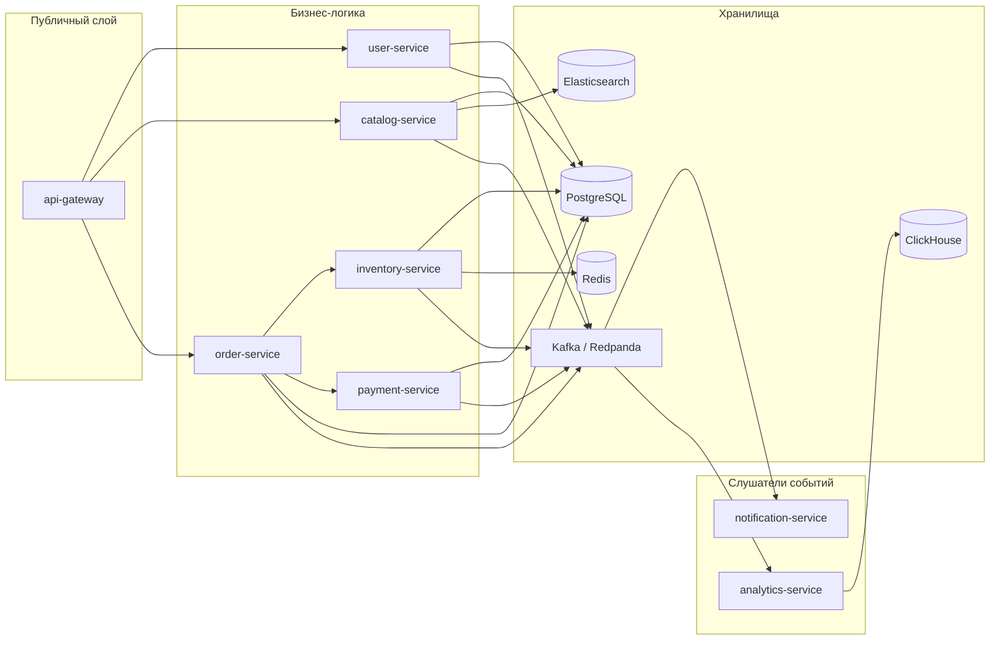
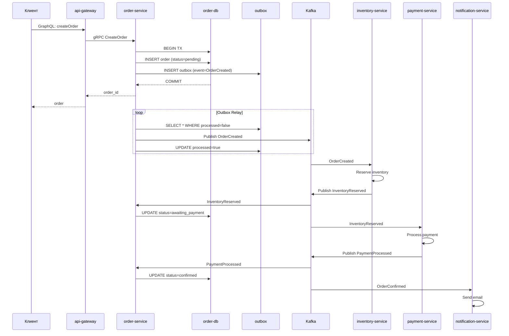
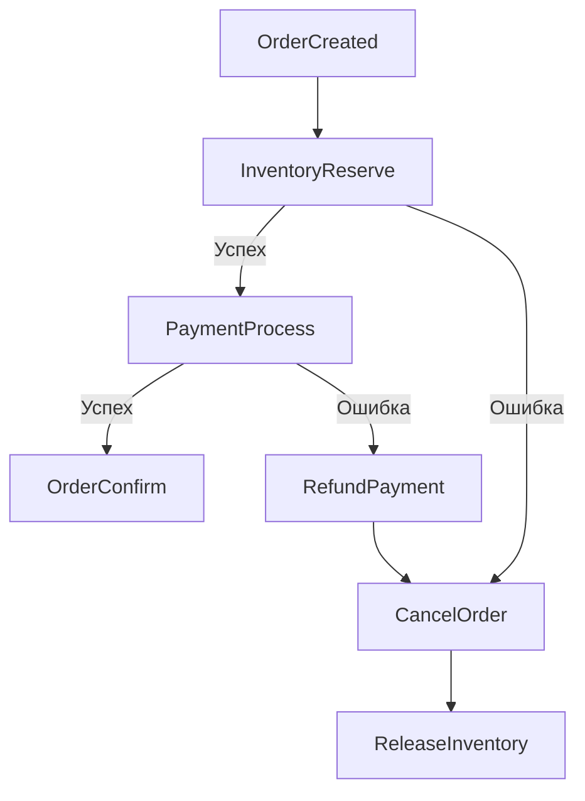
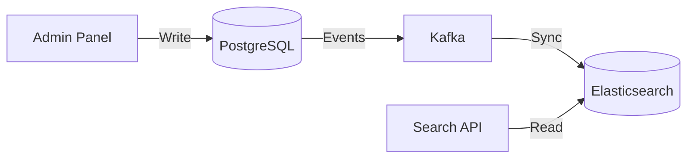

# Архитектура

Как устроен маркетплейс изнутри: сервисы, потоки данных, паттерны.

## Сервисы и их зоны ответственности

| Сервис | Что делает | Хранилище | Ключевой паттерн |
|--------|------------|-----------|-----------------|
| **api-gateway** | Принимает GraphQL, маршрутизирует на gRPC, rate limiting, access-log | — | API Gateway, Rate Limiter |
| **user-service** | Регистрация, аутентификация, JWT с ролями | PostgreSQL | — |
| **catalog-service** | CRUD товаров, категории, публикация событий | PostgreSQL + Elasticsearch | CQRS, Outbox |
| **order-service** | Жизненный цикл заказа, оркестрация Saga | PostgreSQL | Saga Orchestrator, Outbox |
| **inventory-service** | Остатки, резервирование, ledger | PostgreSQL + Redis | Optimistic locking, Cache-aside |
| **payment-service** | Проведение платежей, возвраты | PostgreSQL | Saga Participant, DLQ |
| **notification-service** | Email, push-уведомления по событиям | — | Event-driven consumer |
| **analytics-service** | Агрегация событий, отчёты | ClickHouse | Materialized views, Batch insert |

## Поток данных: создание заказа

## Saga: компенсация при ошибке

Если платёж не прошёл — деньги возвращаются, заказ отменяется, резерв снимается.

## CQRS: каталог

- **Записи** — нормализованная схема в PostgreSQL
- **Чтение** — денормализованные документы в Elasticsearch
- Синхронизация через Kafka events

## Связи между сервисами

### Синхронные (gRPC)

| Вызов | От | К | Зачем |
|-------|----|---|-------|
| CreateOrder | api-gateway | order-service | Создать заказ |
| ReserveInventory | order-service | inventory-service | Зарезервировать товар |
| ProcessPayment | order-service | payment-service | Провести платёж |
| GetUser | api-gateway | user-service | Получить профиль |
| SearchProducts | api-gateway | catalog-service | Поиск товаров |

### Асинхронные (Kafka)

| Событие | Продюсер | Консумеры |
|---------|----------|-----------|
| `UserRegistered` | user-service | notification-service, analytics-service |
| `ProductCreated` | catalog-service | analytics-service |
| `OrderCreated` | order-service | inventory-service, analytics-service |
| `InventoryReserved` | inventory-service | order-service, payment-service |
| `InventoryReservationFailed` | inventory-service | order-service (компенсация) |
| `PaymentProcessed` | payment-service | order-service, notification-service, analytics-service |
| `PaymentFailed` | payment-service | order-service (компенсация), notification-service |
| `OrderConfirmed` | order-service | notification-service, analytics-service |
| `OrderCancelled` | order-service | inventory-service (освобождение), notification-service, analytics-service |

## Масштабирование

- **api-gateway** — stateless, масштабируется горизонтально, rate limiter через Redis
- **catalog-service** — read-heavy, кэш в Redis, поиск в Elasticsearch
- **order-service** — Saga state machine в БД, можно шардировать по `user_id`
- **inventory-service** — ledger + optimistic locking, шардирование по `product_id`
- **analytics-service** — batch insert в ClickHouse, партиционирование по месяцам
