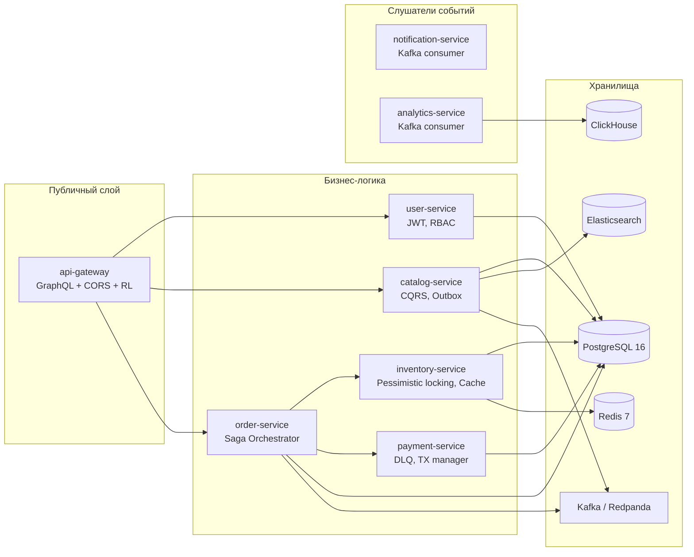
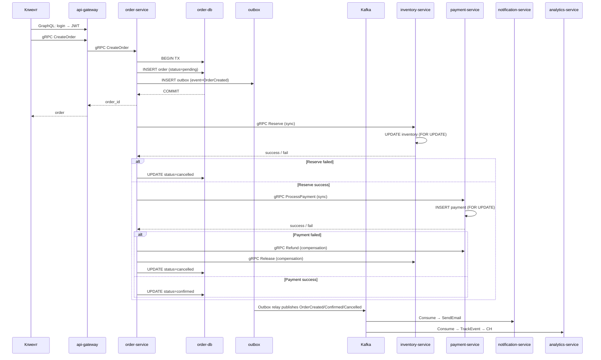
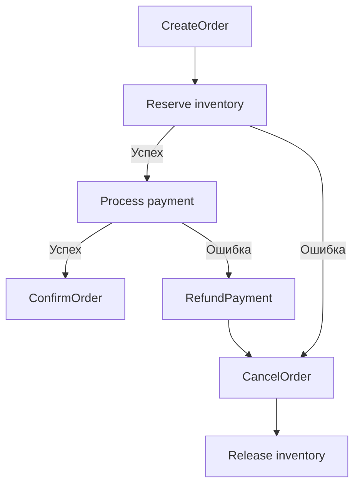
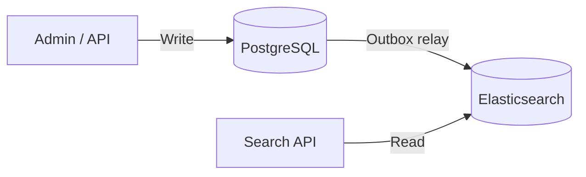
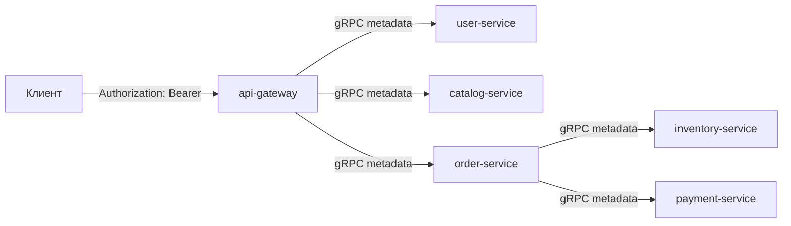
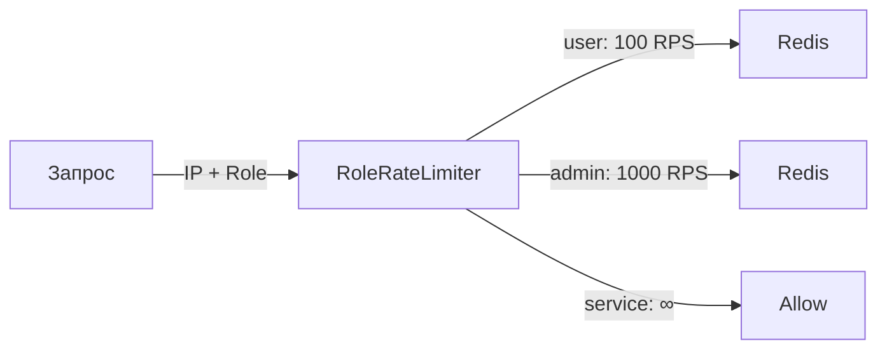
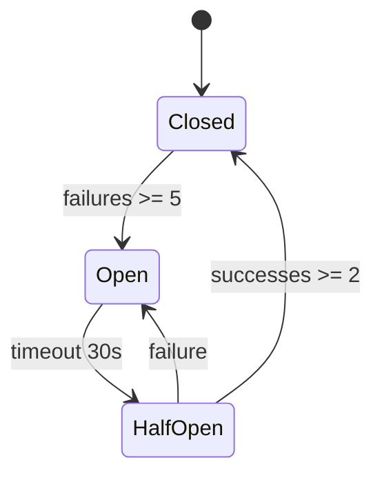
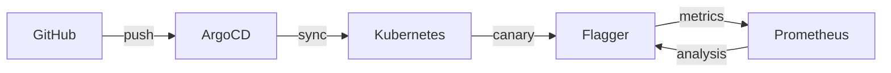

# Архитектура go-ozon-marketplace

**Версия:** 0.3.0  
**Дата обновления:** 2026-06-11

Как устроен маркетплейс изнутри: сервисы, потоки данных, паттерны, безопасность, надёжность и наблюдаемость.

---

## Сервисы и их зоны ответственности

| Сервис | Что делает | Хранилище | Ключевой паттерн |
|--------|------------|-----------|-----------------|
| **api-gateway** | GraphQL → gRPC, rate limiting by role, CORS, access-log, `/metrics` | — | API Gateway, Rate Limiter |
| **user-service** | Регистрация, аутентификация, JWT с полными RegisteredClaims | PostgreSQL | — |
| **catalog-service** | CRUD товаров, поиск (ES), Outbox relay в ES + Kafka | PostgreSQL + ES | CQRS, Outbox |
| **order-service** | Жизненный цикл заказа, Saga Orchestrator, recovery worker | PostgreSQL | Saga Orchestrator, Outbox |
| **inventory-service** | Остатки, резервирование, inventory ledger | PostgreSQL + Redis | Pessimistic locking, Cache-aside |
| **payment-service** | Проведение платежей, возвраты, DLQ | PostgreSQL | Saga Participant, DLQ |
| **notification-service** | Email по событиям из Kafka | — | Event-driven consumer |
| **analytics-service** | Запись событий, выручка за день | ClickHouse | Batch insert, Event-driven |

---

## Поток данных: создание заказа (Saga)

**Важно:**
- Saga шаги выполняются через **прямые gRPC вызовы** (синхронно)
- Kafka используется для **Outbox relay** — публикация доменных событий для downstream consumers
- DLQ в order-service outbox: после 5 ретраев событие уходит в `outbox_dlq`

---

## Saga: компенсация при ошибке

**Recovery worker:** фоновый процесс в `order-service` сканирует `sagas` с незавершённым статусом и доисполняет / компенсирует их.

---

## CQRS: каталог

- **Записи** — нормализованная схема в PostgreSQL
- **Чтение** — денормализованные документы в Elasticsearch
- Синхронизация через **Outbox relay** напрямую в ES (не через Kafka)

---

## Связи между сервисами

### Синхронные (gRPC)

| Вызов | От | К | Зачем |
|-------|----|---|-------|
| Register / Login | api-gateway | user-service | Аутентификация |
| GetUser | api-gateway | user-service | Профиль (IDOR-защита: себе или admin) |
| CreateProduct / GetProduct / SearchProducts | api-gateway | catalog-service | Каталог |
| CreateOrder / GetOrder / ListOrders / CancelOrder | api-gateway | order-service | Заказы |
| Reserve / Release / GetStock | order-service | inventory-service | Резервирование |
| ProcessPayment / Refund | order-service | payment-service | Платежи |
| SendEmail | напрямую | notification-service | Email (service role) |
| TrackEvent / GetDailyRevenue | напрямую | analytics-service | Аналитика (service role) |

### Асинхронные (Kafka)

| Событие | Продюсер | Консумеры | Назначение |
|---------|----------|-----------|------------|
| `OrderCreated` | order-service (outbox) | analytics-service, notification-service | Аналитика, уведомления |
| `OrderConfirmed` | order-service (outbox) | notification-service | Email «заказ подтверждён» |
| `OrderCancelled` | order-service (outbox) | notification-service | Email «заказ отменён» |
| `PaymentFailed` | payment-service (DLQ) | notification-service | Email «ошибка оплаты» |

---

## Security Layer

### JWT с RegisteredClaims

- Алгоритм: **HS256**
- Поля токена: `sub` (user_id), `iss`, `aud`, `jti`, `iat`, `nbf`, `exp`, `role`
- Валидация: `WithValidMethods`, `WithExpirationRequired`, `WithIssuer`, `WithAudience`
- Секрет: минимум 32 символа (fail-fast при старте)
- Срок жизни: 24 часа (конфигурируется)

### mTLS

- Все gRPC вызовы между сервисами поддерживают mTLS через `CERT_PATH`
- Генерация: `./scripts/generate-certs.sh`
- Fallback: `insecure.NewCredentials()` если `CERT_PATH` не задан

### Rate Limiting by Role

- Sliding window в Redis (Lua-скрипт `ZREMRANGEBYSCORE`)
- Graceful degradation: если Redis недоступен — `fail open`
- X-Forwarded-For с проверкой trusted CIDRs

### CORS

- Настраивается через `CORS_ALLOWED_ORIGINS`
- Поддерживает preflight `OPTIONS`
- Credentials allowed

### Input Validation

Централизованные правила в `pkg/validation/`:
- Email: regex с базовой валидацией
- Пароль: минимум 8 символов
- Имя: 2–100 символов
- Цена / количество: `> 0`
- Page size: 1–100

---

## Reliability

### Circuit Breaker

- Реализация: `pkg/circuitbreaker/circuitbreaker.go`
- Параметры: `failureThreshold=5`, `successThreshold=2`, `timeout=30s`
- Применение: `api-gateway` на всех исходящих gRPC вызовах

### Health Probes

- gRPC health checks (`grpc.health.v1.Health/Check`) во всех сервисах
- Используются в Kubernetes liveness/readiness probes
- Метрики сервер: отдельный HTTP-порт (`METRICS_PORT = GRPC_PORT + 1000`)

### Automated Rollback

- **Flagger canary** для `api-gateway`: автоматический rollback при падении success rate < 99% или latency > 500ms
- **ArgoCD**: `selfHeal: true` с автоматической синхронизацией

### Transactional Outbox

| Сервис | Outbox таблица | Куда relay | DLQ |
|--------|---------------|------------|-----|
| order-service | `outbox` | Kafka | `outbox_dlq` |
| catalog-service | `outbox` | Elasticsearch | нет |

- Relay: ticker 500ms, batch 100, экспоненциальный backoff (max 5 retries)

---

## GitOps & Деплой

- **ArgoCD**: `application-marketplace.yaml` → Helm charts → namespace `marketplace-staging`
- **Flagger**: Canary для `api-gateway` (maxWeight 50%, stepWeight 10%, interval 30s)
- **Staging**: отдельный namespace + `values-staging.yaml` для каждого сервиса
- **HPA**: по CPU и memory для всех сервисов (min 1, max 10)
- **PDB**: `PodDisruptionBudget` для критичных сервисов

---

## Monitoring & Observability

### Стек

| Компонент | Назначение | URL (local) |
|-----------|-----------|-------------|
| Prometheus | Метрики, алерты | http://localhost:9090 |
| Grafana | Dashboards | http://localhost:3000 |
| Jaeger | Distributed traces | http://localhost:16686 |

### Prometheus Alerts

- `HighErrorRate` — ошибки > 1% за 5 мин
- `HighLatency` — p99 > 500ms за 5 мин
- `LowAvailability` — uptime < 99.9% за час
- `DBConnectionsHigh` — > 80% пула
- `RedisMemoryHigh` — > 80% памяти
- `KafkaConsumerLag` — lag > 1000

### Grafana Dashboards

1. **RED Method** (`uid: red-method`) — Request Rate, Error Rate, Duration p50/p95/p99
2. **Business Metrics** (`uid: business-metrics`) — Orders Created/Confirmed/Cancelled, Revenue, Active Users
3. **Infrastructure** (`uid: infrastructure`) — CPU, Memory, DB Connections, Redis Hit Ratio, Kafka Lag, ClickHouse Inserts

### SLO / SLI

| SLI | SLO | Метрика |
|-----|-----|---------|
| Доступность | 99.9% | `avg_over_time(up[1h])` |
| Латентность | p99 < 500ms | `histogram_quantile(0.99, rate(grpc_server_handling_seconds_bucket[5m]))` |
| Error Rate | < 1% | `rate(grpc_server_handled_total{status!="OK"}[5m]) / rate(grpc_server_handled_total[5m])` |

### Трейсинг

- OpenTelemetry OTLP HTTP exporter
- Propagation через gRPC metadata
- `trace_id` в structured JSON логах (Zap)

---

## Масштабирование

| Сервис | Стратегия | Примечание |
|--------|-----------|------------|
| api-gateway | Stateless, HPA | Rate limiter через Redis (shared state) |
| catalog-service | HPA | Read-heavy, ES для поиска |
| order-service | HPA | Saga state machine в БД, горизонтально безопасно |
| inventory-service | HPA | `FOR UPDATE` + Redis cache, конкуренция на строках |
| payment-service | HPA | TX manager с `FOR UPDATE`, DLQ для ошибок |
| analytics-service | HPA | Batch insert в ClickHouse |

---

## Что ещё не реализовано / в дорожной карте

- **WebSocket** — зависимость в `go.mod`, реализация не завершена
- **Feature flags** — не реализованы (запланированы: Redis-backed engine)
- **Chaos engineering** — нет тестов / Chaos Mesh манифестов
- **Security headers** (`X-Content-Type-Options`, `X-Frame-Options` и т.д.) — не добавлены в HTTP-ответы gateway
- **Optimistic locking** — используется pessimistic (`FOR UPDATE`)
- **Materialized views в ClickHouse** — не настроены
