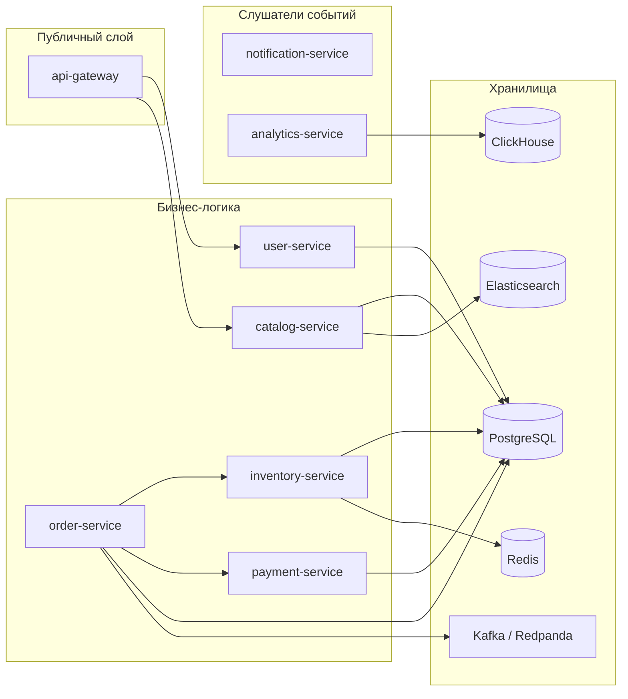
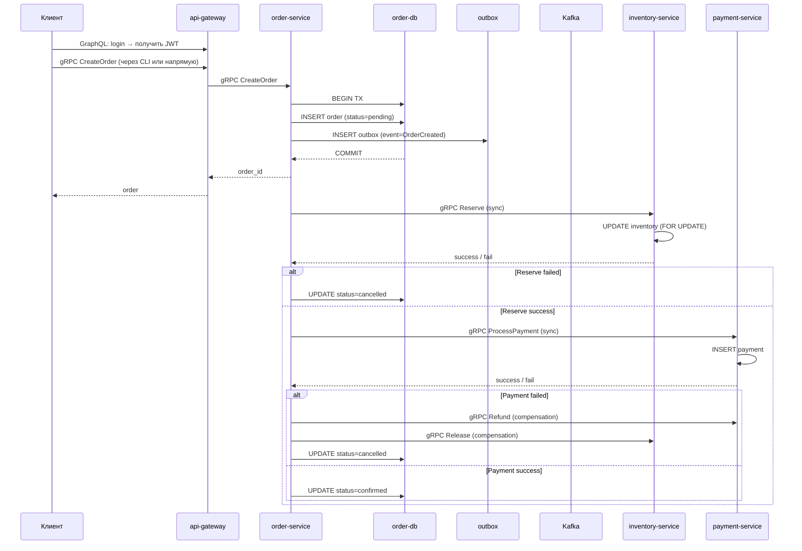
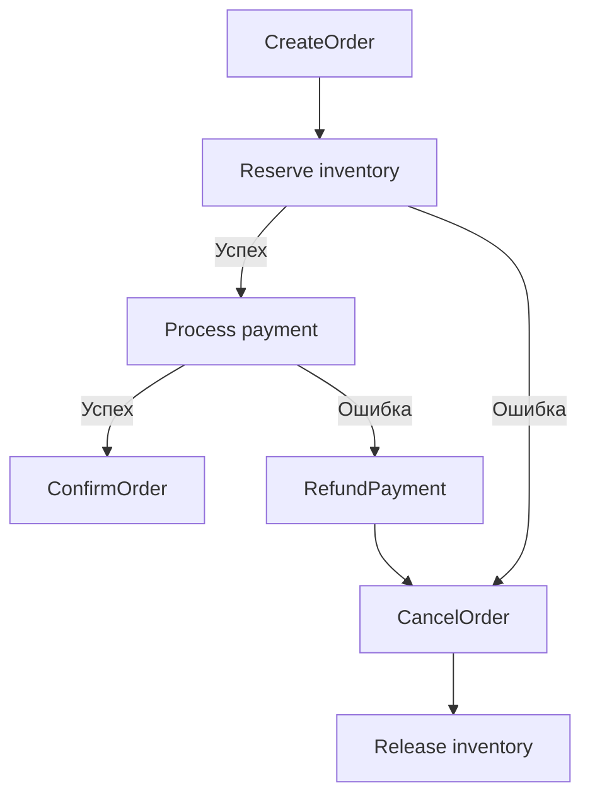
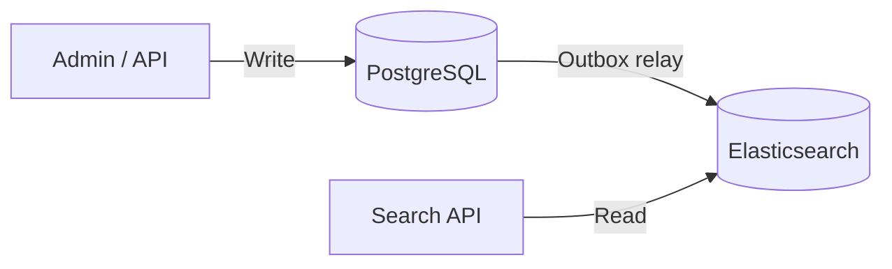

# Архитектура

Как устроен маркетплейс изнутри: сервисы, потоки данных, паттерны.

## Сервисы и их зоны ответственности

| Сервис | Что делает | Хранилище | Ключевой паттерн |
|--------|------------|-----------|-----------------|
| **api-gateway** | Принимает GraphQL, маршрутизирует на gRPC, rate limiting, access-log | — | API Gateway, Rate Limiter |
| **user-service** | Регистрация, аутентификация, JWT с ролями | PostgreSQL | — |
| **catalog-service** | CRUD товаров, поиск (ES), Outbox relay в Elasticsearch | PostgreSQL + Elasticsearch | CQRS, Outbox |
| **order-service** | Жизненный цикл заказа, Saga Orchestrator | PostgreSQL | Saga Orchestrator, Outbox |
| **inventory-service** | Остатки, резервирование | PostgreSQL + Redis | Pessimistic locking (FOR UPDATE), Cache-aside |
| **payment-service** | Проведение платежей, возвраты | PostgreSQL | Saga Participant |
| **notification-service** | Отправка email по gRPC (service-only) | — | — |
| **analytics-service** | Запись событий, выручка за день | ClickHouse | Batch insert |

## Поток данных: создание заказа (Saga)

**Важно:** Saga работает через **прямые gRPC вызовы**, не через Kafka events. Kafka используется только для Outbox релея (публикация событий, пока без consumers).

## Saga: компенсация при ошибке

## CQRS: каталог

- **Записи** — нормализованная схема в PostgreSQL
- **Чтение** — денормализованные документы в Elasticsearch
- Синхронизация через **Outbox relay напрямую в ES** (не через Kafka)

## Связи между сервисами

### Синхронные (gRPC)

| Вызов | От | К | Зачем |
|-------|----|---|-------|
| Register / Login | api-gateway | user-service | Аутентификация |
| GetUser | api-gateway | user-service | Получить профиль |
| CreateProduct / GetProduct / SearchProducts | api-gateway | catalog-service | Каталог |
| CreateOrder / GetOrder / ListOrders | напрямую | order-service | Заказы |
| Reserve / Release / GetStock | order-service | inventory-service | Резервирование |
| ProcessPayment / Refund | order-service | payment-service | Платежи |
| SendEmail | напрямую | notification-service | Email (service-only) |
| TrackEvent / GetDailyRevenue | напрямую | analytics-service | Аналитика (service-only) |

### Асинхронные (Kafka)

Пока используется только в **order-service** для Outbox релея. Consumers ещё не реализованы.

| Событие | Продюсер | Консумеры |
|---------|----------|-----------|
| `OrderCreated` | order-service | *(пока нет)* |

## Масштабирование

- **api-gateway** — stateless, масштабируется горизонтально, rate limiter через Redis
- **catalog-service** — read-heavy, кэш в Redis, поиск в Elasticsearch
- **order-service** — Saga state machine в БД
- **inventory-service** — `FOR UPDATE` + Redis cache
- **analytics-service** — batch insert в ClickHouse

## Что ещё не реализовано

- Kafka consumers в notification-service и analytics-service
- Circuit breaker
- DLQ в payment-service (есть только в order-service outbox)
- Optimistic locking (используется pessimistic)
- Materialized views в ClickHouse
- ZSTD сжатие и TTL в ClickHouse
