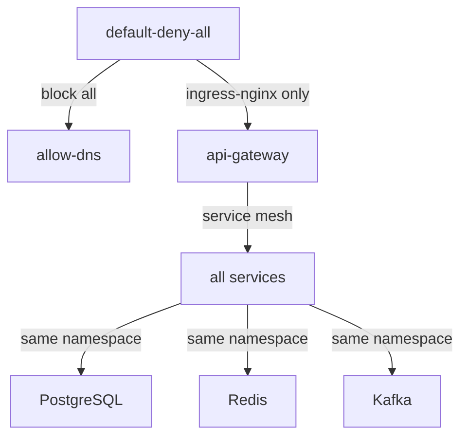

# Безопасность go-ozon-marketplace

**Версия:** 0.3.0  
**Дата обновления:** 2026-06-11

Как защищён маркетплейс: аутентификация, авторизация, шифрование, rate limiting, circuit breaker, input validation, CORS.

---

## Аутентификация

### JWT с RegisteredClaims

Все клиентские запросы проходят через `api-gateway`. Gateway прокидывает `Authorization` в gRPC metadata, а downstream сервисы валидируют JWT через `AuthUnaryInterceptor`.

**Реализовано:**
- Алгоритм: **HS256** (`WithValidMethods([]string{"HS256"})`)
- Поля RegisteredClaims:
  - `iss` (Issuer) — `go-ozon-marketplace`
  - `aud` (Audience) — `go-ozon-marketplace`
  - `sub` (Subject) — `user_id`
  - `jti` (ID) — UUID v4
  - `iat` (IssuedAt) — UTC
  - `nbf` (NotBefore) — UTC
  - `exp` (ExpiresAt) — конфигурируется (default: 24 часа)
- `WithExpirationRequired()` — токен обязан содержать `exp`
- Валидация `iss` и `aud` на каждом gRPC вызове

**Код:**
- Генерация: `pkg/auth/jwt.go`
- Валидация gRPC: `pkg/middleware/auth.go`
- Валидация HTTP: `pkg/middleware/http.go`

### Пример токена

```json
{
  "user_id": "user-123",
  "role": "user",
  "iss": "go-ozon-marketplace",
  "aud": ["go-ozon-marketplace"],
  "sub": "user-123",
  "jti": "a1b2c3d4-e5f6-7890-abcd-ef1234567890",
  "iat": 1718086400,
  "nbf": 1718086400,
  "exp": 1718172800
}
```

### Secret Validation

При старте `user-service` происходит fail-fast проверка:

```go
jwtSecret := config.MustGetEnv("JWT_SECRET")
if len(jwtSecret) < 32 {
    panic("JWT_SECRET must be at least 32 characters long")
}
```

**Требования:**
- Минимум 32 символа
- Передача через env var (никогда не хардкодится)
- Ротация секрета требует перезапуска всех сервисов

---

## Авторизация (RBAC)

Три роли:

| Роль | Описание | Доступ |
|------|----------|--------|
| `user` | Обычный покупатель | Свои заказы, профиль, каталог |
| `admin` | Администратор | CRUD товаров, все заказы, все пользователи |
| `service` | Другой микросервис | Внутренние RPC (`inventory-service`, `notification-service`) |

### Проверка ролей

В коде gRPC handler:

```go
role, ok := middleware.GetRole(ctx)
if !ok || role != middleware.RoleAdmin {
    return nil, status.Error(codes.PermissionDenied, "admin required")
}
```

Или через хелпер:

```go
if err := middleware.RequireRole(ctx, middleware.RoleAdmin); err != nil {
    return nil, err
}
```

### IDOR / BOLA защита

`GetUser` доступен только себе или админу:

```go
// user-service internal/delivery/grpc/handler.go
if role != middleware.RoleAdmin && reqUserID != callerUserID {
    return nil, status.Error(codes.PermissionDenied, "access denied")
}
```

### Публичные эндпоинты

Аутентификация пропускается для:
- `/user.v1.UserService/Register`
- `/user.v1.UserService/Login`
- `/grpc.health.v1.Health/Check`

---

## mTLS между сервисами

Все gRPC вызовы между сервисами поддерживают mTLS:

- Если задан `CERT_PATH` — используется `LoadClientMTLSCredentials` / `LoadServerMTLSCredentials`
- Если `CERT_PATH` пуст — используется `insecure.NewCredentials()`

**Генерация сертификатов:**

```bash
./scripts/generate-certs.sh
```

**Файлы:**
- `server-cert.pem` / `server-key.pem` — сертификат сервера
- `ca-cert.pem` — CA для mutual verification

> mTLS **опционален** для локальной разработки, **обязателен** в production.

---

## Rate Limiting by Role

Sliding window rate limiter в `api-gateway`:

| Роль | Лимит | Окно |
|------|-------|------|
| `user` | 100 RPS | 1 секунда |
| `admin` | 1000 RPS | 1 секунда |
| `service` | ∞ | — |

**Хранение счётчиков:** Redis (Lua-скрипт `ZREMRANGEBYSCORE`)

**X-Forwarded-For:**
- Учитывается только при наличии `TRUSTED_PROXIES` (CIDR-список)
- Если peer не в trusted — используется `RemoteAddr`

**Graceful degradation:** Если Redis недоступен — `fail open` (пропускаем запрос)

**При превышении лимита:**

```json
{
  "errors": [
    {
      "message": "rate limit exceeded"
    }
  ]
}
```

**Код:** `pkg/middleware/ratelimit.go`

---

## Circuit Breaker

Circuit breaker защищает gateway от каскадных отказов downstream-сервисов.

**Параметры (api-gateway):**
- `failureThreshold` = 5 ошибок подряд → `Open`
- `successThreshold` = 2 успеха → `Closed`
- `timeout` = 30 секунд → переход в `HalfOpen`

**Применение:**
- Интерцептор на всех исходящих gRPC соединениях gateway
- При `Open` — мгновенный отказ без вызова downstream

**Код:** `services/api-gateway/internal/app/infra.go` (обёртка `github.com/sony/gobreaker`), применение в `services/api-gateway/internal/clients/adapter.go`

---

## Input Validation

Централизованная валидация реализована через `protovalidate` интерцептор (`pkg/middleware/protovalidate.go`) и правила `buf.validate` в `.proto`-файлах:

| Поле | Правило |
|------|---------|
| Email | Regex: `^[a-zA-Z0-9._%+\-]+@[a-zA-Z0-9.\-]+\.[a-zA-Z]{2,}$` |
| Пароль | Минимум 8 символов |
| Имя | 2–100 символов |
| Цена | `> 0` |
| Количество | `> 0` |
| Page size | 1–100 |

**Валидация на уровне usecase** — до обращения к БД.

### GraphQL Complexity Limits

- `MaxBytesReader` на HTTP body (`MAX_BODY_SIZE_BYTES = 1MB`)
- `pageSize` clamp: 1–100
- Introspection и Playground за env-флагом (выключены в production по умолчанию)

---

## CORS Policy

Настраивается через `CORS_ALLOWED_ORIGINS` (comma-separated).

**Default:** `*` (для разработки)

**Production:** явный whitelist:

```bash
CORS_ALLOWED_ORIGINS=https://marketplace.example.com,https://admin.marketplace.example.com
```

**Заголовки:**
- `Access-Control-Allow-Origin`
- `Access-Control-Allow-Methods: GET, POST, OPTIONS`
- `Access-Control-Allow-Headers: Content-Type, Authorization`
- `Access-Control-Allow-Credentials: true`

**Preflight:** `OPTIONS` возвращает `200 OK` без проксирования downstream.

**Код:** `services/api-gateway/internal/app/app.go`

---

## Security Headers

> **Статус:** Не реализованы в текущей версии. Запланированы к добавлению в gateway.

**Ожидаемые заголовки:**

| Заголовок | Значение | Защита от |
|-----------|----------|-----------|
| `X-Content-Type-Options` | `nosniff` | MIME-sniffing |
| `X-Frame-Options` | `DENY` | Clickjacking |
| `Content-Security-Policy` | `default-src 'self'` | XSS, injection |
| `Strict-Transport-Security` | `max-age=31536000; includeSubDomains` | Downgrade to HTTP |
| `X-XSS-Protection` | `1; mode=block` | Reflected XSS (legacy) |
| `Referrer-Policy` | `strict-origin-when-cross-origin` | Утечка referrer |

---

## Защита данных

### Пароли

- Хеширование через **bcrypt** с `DefaultCost = 10`
- Никогда не хранятся в открытом виде
- Анти-энумерация: единая ошибка логина, dummy-bcrypt на not-found
- Защита от timing-атак: постоянное время проверки

### Деньги

- В БД — `BIGINT` (копейки / minor units, `price * 100`)
- В proto и GraphQL — `double` / `Float` (доллары / рубли)
- CHECK constraints: `price > 0`, `quantity > 0`, `total_amount >= 0`

### SQL-инъекции

- Использование **pgx** с параметризованными запросами (`$1`, `$2`)
- Никакого конкатенации SQL

### NoSQL-инъекции

- Elasticsearch: query builder через `olivere/elastic`, без raw JSON拼接

---

## Сетевая безопасность

### Kubernetes NetworkPolicies



- `default-deny-all` — блокировка всего ingress/egress по умолчанию
- `api-gateway` — ingress только из `ingress-nginx`
- `order-service` — egress только к `inventory-service` и `payment-service`

**Манифесты:** `infra/k8s/network-policies/`

---

## Аудит

Логи содержат:
- `trace_id` — для связывания запросов (через OTel context propagation)
- `user_id` — кто делал запрос
- `method` — какой метод вызван
- `duration` — сколько заняло
- `request_id` — уникальный ID запроса (HTTP-level)

Все логи — structured JSON через Zap.

**Что НЕ логируется:**
- JWT tokens
- Пароли
- PII (email, имена) — только ID
- Payment payloads

---

## Secrets Management

| Секрет | Источник | Примечание |
|--------|----------|------------|
| JWT secret | `JWT_SECRET` env var | Минимум 32 символа |
| Пароли БД | `POSTGRES_DSN` env var | В Helm через Kubernetes Secrets |
| TLS ключи | `CERT_PATH` env var | Монтируются как volume |
| Redis | Нет пароля (localhost) | В production: Redis ACL + password |

**Kubernetes:**
- Secrets хранятся в `infra/k8s/helm-charts/*/templates/secret.yaml`
- В production: интеграция с Vault / External Secrets Operator (запланировано)

---

## Security Checklist

- [ ] JWT secret ≥ 32 символов
- [ ] mTLS включён в production (`CERT_PATH` задан)
- [ ] Rate limiting включён (Redis доступен)
- [ ] CORS origins заданы явно (не `*`)
- [ ] GraphQL introspection отключён в production
- [ ] NetworkPolicies применены
- [ ] Логи не содержат PII
- [ ] Все сервисы на последней стабильной версии зависимостей
- [ ] `govulncheck` проходит в CI
