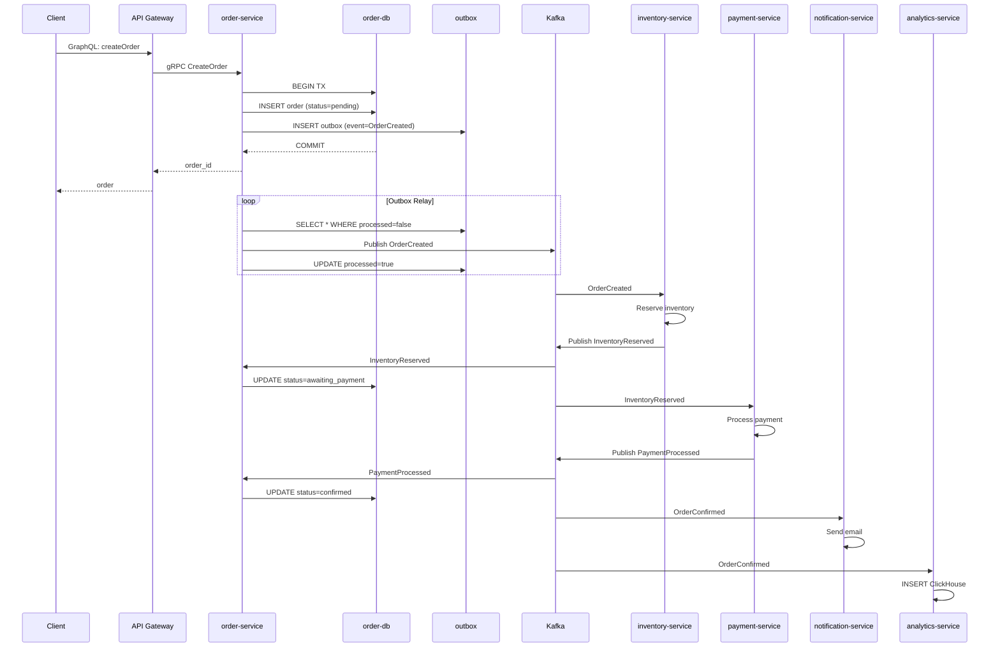

# go-ozon-marketplace — Design Document

**Date:** 2026-06-10  
**Status:** Approved  
**Scope:** Демонстрация production-grade микросервисного e-commerce backend на Go (аудит: 80+ задач выполнено)

---

## 1. Overview

`go-ozon-marketplace` — это production-grade демонстрация микросервисного e-commerce маркетплейса на Go. Проект прошёл полный аудит безопасности, надёжности и наблюдаемости (80+ задач) и демонстрирует паттерны, используемые в высоконагруженных системах Ozon.

Каждое решение обосновано и отслеживается через ADR.

---

## 2. Goals & Success Criteria

### Primary Goals
1. Продемонстрировать мастерство Go в распределённых системах
2. Показать Ozon-релевантный стек: gRPC, Kafka, PostgreSQL, Redis, ClickHouse, Kubernetes
3. Реализовать критичные паттерны: CQRS, Saga, Outbox, Rate Limiting, mTLS
4. Обеспечить полную наблюдаемость: метрики, трейсы, структурированные логи

### Success Criteria
- [x] Все 8 сервисов запускаются (`make up`)
- [x] End-to-end flow: create → reserve → pay → notify (включая Saga compensation)
- [x] Unit + integration тесты с gomock + testcontainers
- [x] Покрытие > 60% (coverage gate в CI)
- [x] Актуальная архитектурная документация и ADR
- [x] Kubernetes манифесты с Helm charts

---

## 3. Architecture

### 3.1. Service Topology

```
┌─────────────────────────────────────────────────────────────┐
│                        Clients                               │
│         (Web App / Mobile / Postman / GraphQL Playground)   │
└──────────────────────┬──────────────────────────────────────┘
                       │ HTTP / GraphQL
                       ▼
┌─────────────────────────────────────────────────────────────┐
│  api-gateway  │ GraphQL Gateway, Rate Limiting, Auth        │
│               │ gRPC client to all downstream services      │
└───────┬───────┴──────────────┬──────────────────────────────┘
        │ gRPC                  │ Kafka (async events)
        ▼                       ▼
┌───────────┐  ┌───────────┐  ┌───────────┐  ┌───────────┐
│  user-    │  │  catalog- │  │  order-   │  │  payment- │
│  service  │  │  service  │  │  service  │  │  service  │
│  (PG)     │  │  (PG+ES)  │  │  (PG)     │  │  (PG)     │
└───────────┘  └───────────┘  └─────┬─────┘  └─────┬─────┘
                                    │              │
┌───────────┐  ┌───────────┐        │ Kafka        │ Kafka
│  inventory│  │  analytics│        ▼              ▼
│  -service │  │  -service │  ┌───────────┐  ┌───────────┐
│  (PG+Redis│  │  (CH)     │  │notification│  │   DLQ     │
└───────────┘  └───────────┘  │  -service  │  │  (Kafka)  │
                              └───────────┘  └───────────┘
```

### 3.2. Service Responsibilities

| Service | Domain | Storage | Key Patterns |
|---------|--------|---------|--------------|
| `api-gateway` | API composition, routing | None | API Gateway, Rate Limiter |
| `user-service` | Identity, JWT, profiles | PostgreSQL | — |
| `catalog-service` | Products, categories, search | PostgreSQL + Elasticsearch | CQRS |
| `order-service` | Order lifecycle, orchestration | PostgreSQL | Event Sourcing, Outbox, Saga Orchestrator |
| `inventory-service` | Stock levels, reservation | PostgreSQL + Redis | Optimistic locking, Cache-aside |
| `payment-service` | Payment processing, refunds | PostgreSQL | Saga Participant, DLQ |
| `notification-service` | Email, push notifications | None | Event-driven consumer |
| `analytics-service` | Event aggregation, reports | ClickHouse | Materialized views, Batch insert |

---

## 4. Communication Patterns

### 4.1. Synchronous — gRPC
- Unary RPC for most operations (get user, create product)
- Server streaming for search results (catalog search with pagination)
- gRPC-Gateway exposes REST/GraphQL on top of proto contracts

### 4.2. Asynchronous — Kafka
All services publish domain events to Kafka:

| Event | Producer | Consumers |
|-------|----------|-----------|
| `UserRegistered` | user-service | notification-service, analytics-service |
| `ProductCreated` | catalog-service | analytics-service |
| `OrderCreated` | order-service | inventory-service, analytics-service |
| `InventoryReserved` | inventory-service | order-service, payment-service |
| `InventoryReservationFailed` | inventory-service | order-service (compensation) |
| `PaymentProcessed` | payment-service | order-service, notification-service, analytics-service |
| `PaymentFailed` | payment-service | order-service (compensation), notification-service |
| `OrderConfirmed` | order-service | notification-service, analytics-service |
| `OrderCancelled` | order-service | inventory-service (release), notification-service, analytics-service |

---

## 5. Critical Patterns

### 5.1. Transactional Outbox (order-service)
1. Business transaction writes to `orders` table AND `outbox` table in same DB transaction
2. Separate relay process polls `outbox` and publishes to Kafka
3. Marks outbox record as `processed`

**Why:** Guarantees at-least-once delivery without 2PC.

### 5.2. Saga — Order Processing
```
OrderCreated → InventoryReserve → PaymentProcess → OrderConfirm
                    ↓                      ↓
            ReserveFailed ──────────→ PaymentFailed
                    ↓                      ↓
              CancelOrder ←────────── Compensate
```

**Orchestrator:** order-service manages state machine.
**Compensation:** If any step fails, previous steps are compensated (release inventory, refund payment).

### 5.3. CQRS — Catalog Search
- **Write model:** PostgreSQL (normalized schema for product CRUD)
- **Read model:** Elasticsearch (denormalized product documents for search/filter)
- catalog-service publishes `ProductCreated/Updated/Deleted` → Kafka → analytics-service or sync worker updates ES

### 5.4. Circuit Breaker
- Implemented in gRPC client middleware (api-gateway → downstream)
- States: Closed → Open → Half-Open
- Prevents cascade failures during service degradation

### 5.5. Rate Limiting
- Token Bucket algorithm in api-gateway
- Redis-backed for distributed rate limiting across gateway replicas

---

## 6. Technology Stack

### 6.1. Core
| Component | Technology | Version |
|-----------|------------|---------|
| Language | Go | 1.26 |
| RPC | gRPC + Protocol Buffers | v2 |
| Gateway | gqlgen (GraphQL) | latest |
| DI | uber-go/fx | latest |
| Proto | buf | v1.35+ |

### 6.2. Data & Messaging
| Component | Technology | Notes |
|-----------|------------|-------|
| Primary DB | PostgreSQL 16 | pgx/pgxpool driver, миграции |
| Cache | Redis 7 | go-redis/v9, singleflight |
| Search | Elasticsearch 8 | olivere/elastic, explicit mapping |
| Analytics | ClickHouse 24 | clickhouse-go/v2, партиционирование, ZSTD, TTL |
| Message Broker | Kafka (Redpanda local) | sarama (SyncProducer), Outbox + DLQ |

### 6.3. Security & Reliability
| Component | Technology |
|-----------|------------|
| Auth | JWT (github.com/golang-jwt/jwt/v5) с ролями |
| mTLS | crypto/tls, взаимная аутентификация |
| Rate Limiting | Redis-backed sliding window |
| Saga | Orchestrator с persisted state + recovery |

### 6.4. Observability
| Component | Technology |
|-----------|------------|
| Metrics | Prometheus + Grafana |
| Tracing | OpenTelemetry → OTLP (exporter) |
| Logging | Zap (structured JSON), configurable level/format |
| Health | grpc.health.v1 во всех сервисах |

### 6.5. Testing
| Level | Tool |
|-------|------|
| Unit | testify + gomock |
| Integration | testcontainers-go (PG, Redis, ES, Kafka, CH) |
| E2E | builder pattern + fluent requests |
| Load | ghz |

### 6.6. Infrastructure
| Component | Technology |
|-----------|------------|
| Local Orchestration | Docker Compose |
| Containerization | Docker (multi-stage, distroless) |
| Orchestration | Kubernetes + Helm (HPA, PDB, security contexts) |
| CI/CD | GitHub Actions (SHA-pinned, govulncheck, buf lint) |

---

## 7. Repository Structure

```
go-ozon-marketplace/
├── api/                          # Proto contracts (separate go.mod)
│   ├── proto/
│   │   ├── user/v1/user.proto
│   │   ├── catalog/v1/catalog.proto
│   │   ├── order/v1/order.proto
│   │   ├── inventory/v1/inventory.proto
│   │   ├── payment/v1/payment.proto
│   │   └── notification/v1/notification.proto
│   ├── buf.yaml
│   └── buf.gen.yaml
├── pkg/                          # Shared libraries (separate go.mod)
│   ├── logger/                   # Zap wrapper with OTel trace context
│   ├── errors/                   # Domain errors + gRPC code mapping
│   ├── middleware/               # gRPC interceptors (logging, recovery, metrics, auth)
│   ├── tracing/                  # OTel tracer provider setup
│   ├── kafka/                    # Producer & Consumer abstractions
│   ├── postgres/                 # Pgx pool + migration runner
│   ├── redis/                    # Redis client wrapper
│   └── server/                   # Graceful shutdown HTTP/gRPC server
├── services/                     # Each service = independent go.mod
│   ├── api-gateway/
│   │   ├── cmd/
│   │   ├── internal/
│   │   │   ├── app/              # fx app composition
│   │   │   ├── delivery/         # HTTP/GraphQL handlers
│   │   │   └── config/
│   │   ├── Dockerfile
│   │   └── go.mod
│   ├── user-service/
│   │   ├── cmd/
│   │   ├── internal/
│   │   │   ├── app/
│   │   │   ├── domain/           # Entities, value objects
│   │   │   ├── usecase/          # Business logic interfaces + impl
│   │   │   ├── repository/       # PG implementations
│   │   │   └── delivery/         # gRPC handlers
│   │   ├── migrations/
│   │   ├── Dockerfile
│   │   └── go.mod
│   ├── catalog-service/
│   ├── order-service/
│   ├── inventory-service/
│   ├── payment-service/
│   ├── notification-service/
│   └── analytics-service/
├── infra/
│   ├── docker/
│   │   └── docker-compose.yml
│   ├── k8s/
│   │   └── base/ + helm-charts/
│   └── monitoring/
│       ├── prometheus/
│       ├── grafana/dashboards/
│       └── jaeger/
├── tests/
│   └── e2e/                      # End-to-end test suites
├── scripts/
│   ├── migrate.sh
│   ├── proto-gen.sh
│   └── seed.sh
├── Makefile
├── go.work
├── .github/
│   └── workflows/
│       ├── ci.yml
│       └── cd.yml
└── README.md
```

---

## 8. Data Flow — Order Creation (Detailed)



---

## 9. Observability Strategy

### 9.1. Logs
- Structured JSON via Zap
- Every log entry contains: `trace_id`, `span_id`, `service`, `timestamp`, `level`, `message`
- Correlation via `context.Context` propagation

### 9.2. Metrics
- **RED method:** Request rate, Error rate, Duration (histogram)
- **Business:** orders_created_total, orders_confirmed_total, revenue_rub
- **Infrastructure:** db_connections_active, kafka_consumer_lag, redis_hit_ratio

### 9.3. Traces
- OpenTelemetry auto-instrumentation for gRPC, HTTP, PostgreSQL, Redis, Kafka
- Trace context propagated via gRPC metadata and Kafka headers
- Jaeger for trace storage and UI

---

## 10. Testing Strategy

### 10.1. Unit Tests
- Table-driven tests (Go idiom)
- testify/assert + mockery for mocks
- Target: domain and usecase layers

### 10.2. Integration Tests
- testcontainers-go for PostgreSQL, Redis, Kafka, ClickHouse, Elasticsearch
- Each service has `*_integration_test.go`
- Run with `go test -tags=integration`

### 10.3. E2E Tests
- cute (ozontech) for HTTP/GraphQL API testing
- Allure reports
- Run against fully deployed Docker Compose stack

### 10.4. Load Tests
- framer for gRPC load generation
- ghz for alternative gRPC benchmarking
- Scenarios: create order, search catalog, get user

---

## 11. Deployment

### 11.1. Local Development
```bash
make up          # docker compose up --build
make test        # unit + integration tests
make e2e         # end-to-end tests
make bench       # load tests with framer
make down        # docker compose down -v
```

### 11.2. Kubernetes
- Helm chart per service (`infra/k8s/helm-charts/<service>/`)
- Base manifests: Deployment, Service, ConfigMap, Secret, Ingress
- HPA based on CPU/memory custom metrics
- PodDisruptionBudget for availability

---

## 12. Risks & Mitigations

| Risk | Impact | Mitigation |
|------|--------|------------|
| Scope too large | High | MVP first: gateway + order + inventory + payment. Add others incrementally |
| Kafka complexity | Medium | Use Redpanda for local dev (Kafka-compatible, single binary) |
| ClickHouse setup | Low | Start with single-node ClickHouse, omit for MVP if needed |
| Test flakiness | Medium | Use testcontainers with fixed versions, retry logic |

---

## 13. References

- [Ozon Tech — "Одна платформа, чтобы править всеми"](https://habr.com/ru/companies/ozontech/articles/708274/)
- [Ozon Tech — Kafka at 5M RPS](https://habr.com/ru/companies/ozontech/articles/749328/)
- [Ozon Tech GitHub](https://github.com/ozontech)
- [Route 256 — Go Middle](https://route256.ozon.ru/go-middle)
- [go-ecommerce-microservices reference](https://github.com/Solymani-Hossein/go-ecommerce-microservices)
- [Watermill — Go event-driven library](https://github.com/ThreeDotsLabs/watermill)

---

## 14. Changelog

| Date | Author | Change |
|------|--------|--------|
| 2026-06-09 | — | Initial design document |
