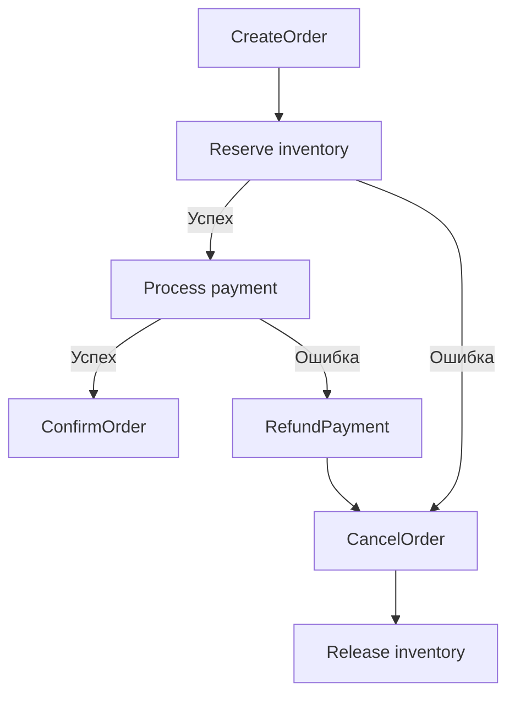

# order-service

Управление заказами: жизненный цикл, Saga Orchestrator, Transactional Outbox.

## Что делает

- Создание и получение заказов
- **Saga Orchestrator** — управляет распределённой транзакцией через прямые gRPC вызовы:
  1. Резерв товара (`inventory-service:Reserve`)
  2. Проведение платежа (`payment-service:ProcessPayment`)
  3. При ошибке — компенсация (`Release`, `Refund`)
- **Transactional Outbox** — гарантированная публикация событий в Kafka
- Статусы: `pending` → `confirmed` | `cancelled`

## API (gRPC)

| Метод | Описание | Auth |
|-------|----------|------|
| `CreateOrder` | Создать заказ | Проверяет `user_id` в токене |
| `GetOrder` | Получить заказ | Проверяет принадлежность `user_id` |
| `ListOrders` | Список заказов | Проверяет принадлежность `user_id` |

## Запуск

```bash
cd services/order-service
POSTGRES_DSN="postgres://..." JWT_SECRET="..." \
  INVENTORY_ADDR=localhost:50053 PAYMENT_ADDR=localhost:50054 \
  go run ./cmd/...
```

## Переменные окружения

| Переменная | Описание | По умолчанию |
|------------|----------|--------------|
| `GRPC_PORT` | gRPC сервер | `50055` |
| `POSTGRES_DSN` | PostgreSQL | **Обязательно** |
| `JWT_SECRET` | Секрет для валидации JWT | **Обязательно** |
| `INVENTORY_ADDR` | Адрес inventory-service | `localhost:50053` |
| `PAYMENT_ADDR` | Адрес payment-service | `localhost:50054` |
| `KAFKA_BROKERS` | Kafka брокеры | `["localhost:9092"]` |
| `KAFKA_TOPIC` | Топик для Outbox | `order-events` |
| `DEFAULT_CALL_TIMEOUT` | Таймаут gRPC вызовов | `5s` |
| `DEFAULT_QUERY_TIMEOUT` | Таймаут gRPC запросов | `3s` |
| `CERT_PATH` | Путь к TLS сертификатам (опционально) | — |

## Saga Flow



## Модель данных

Таблица `orders`:
- `id` (UUID, PK)
- `user_id`
- `status`
- `total_amount` (BIGINT, копейки)
- `created_at`
- `updated_at`

Таблица `order_items`:
- `id` (UUID, PK)
- `order_id`
- `product_id`
- `quantity`
- `price` (BIGINT, копейки)

Таблица `outbox`:
- `id` (UUID, PK)
- `aggregate_id`
- `event_type`
- `payload`
- `processed_at`
- `created_at`

Таблица `sagas`:
- `order_id` (UUID, PK)
- `current_step`
- `status`
- `error_message`
- `created_at`
- `updated_at`

## Outbox Relay

```
┌─────────────┐     ┌──────────┐     ┌────────┐
│  orders DB  │────▶│  outbox  │────▶│ Kafka  │
└─────────────┘     └──────────┘     └────────┘
                           ▲
                           │ poll every 500ms
                    ┌──────┴──────┐
                    │ outbox relay│
                    └─────────────┘
```

## Зависимости

- PostgreSQL (orders + outbox + sagas)
- Kafka (Outbox relay)
- inventory-service (gRPC)
- payment-service (gRPC)
