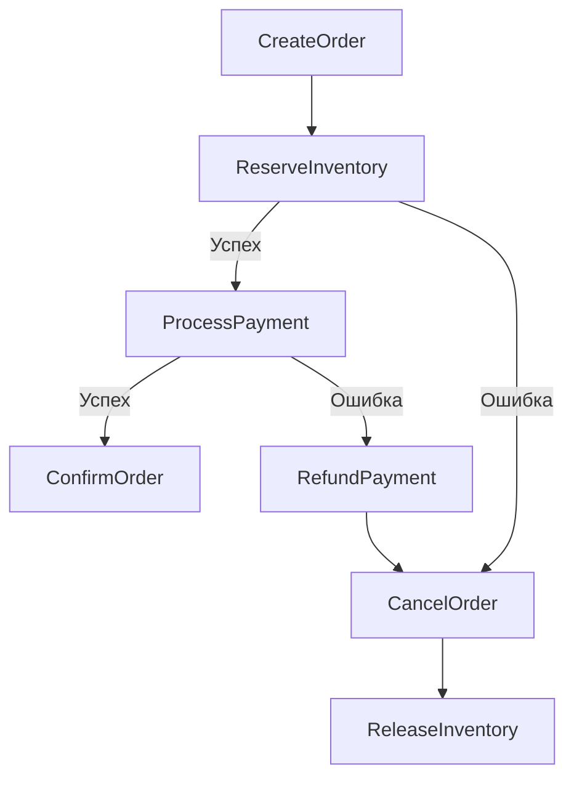

# order-service

Управление заказами: жизненный цикл, Saga Orchestrator, Transactional Outbox.

## Что делает

- Создание и управление заказами
- **Saga Orchestrator** — управляет распределённой транзакцией:
  1. Резерв товара (inventory-service)
  2. Проведение платежа (payment-service)
  3. Подтверждение заказа
  4. При ошибке — компенсация (возврат, отмена резерва)
- **Transactional Outbox** — гарантированная публикация событий в Kafka
- Состояния: `pending` → `awaiting_payment` → `confirmed` | `cancelled`

## API (gRPC)

| Метод | Описание | Auth |
|-------|----------|------|
| `CreateOrder` | Создать заказ | user |
| `GetOrder` | Получить заказ | user (свой) / admin |
| `CancelOrder` | Отменить заказ | user (свой) / admin |
| `ListOrders` | Список заказов | user (свои) / admin |
| `UpdateOrderStatus` | Обновить статус | service (Saga) |

## Запуск

```bash
cd services/order-service
go run ./cmd/...
```

## Переменные окружения

| Переменная | Описание | По умолчанию |
|------------|----------|--------------|
| `GRPC_PORT` | gRPC сервер | `50055` |
| `POSTGRES_URL` | PostgreSQL | — |
| `KAFKA_BROKERS` | Kafka брокеры | `localhost:19092` |
| `INVENTORY_SERVICE_ADDR` | Адрес inventory-service | `localhost:50053` |
| `PAYMENT_SERVICE_ADDR` | Адрес payment-service | `localhost:50054` |
| `SAGA_TIMEOUT` | Таймаут Saga шага | `30s` |
| `OUTBOX_POLL_INTERVAL` | Интервал опроса Outbox | `5s` |
| `LOG_LEVEL` | Уровень логов | `info` |
| `LOG_FORMAT` | Формат логов | `json` |

## Saga Flow



## Модель данных

```sql
CREATE TABLE orders (
    id UUID PRIMARY KEY DEFAULT gen_random_uuid(),
    user_id UUID NOT NULL,
    status VARCHAR(50) NOT NULL DEFAULT 'pending',
    total_minor INT64 NOT NULL,
    created_at TIMESTAMPTZ NOT NULL DEFAULT NOW(),
    updated_at TIMESTAMPTZ NOT NULL DEFAULT NOW()
);

CREATE TABLE order_items (
    id UUID PRIMARY KEY DEFAULT gen_random_uuid(),
    order_id UUID REFERENCES orders(id),
    product_id UUID NOT NULL,
    quantity INT NOT NULL,
    price_minor INT64 NOT NULL
);

CREATE TABLE outbox (
    id UUID PRIMARY KEY DEFAULT gen_random_uuid(),
    aggregate_id UUID NOT NULL,
    event_type VARCHAR(100) NOT NULL,
    payload JSONB NOT NULL,
    processed BOOLEAN NOT NULL DEFAULT FALSE,
    created_at TIMESTAMPTZ NOT NULL DEFAULT NOW()
);

CREATE TABLE saga_state (
    order_id UUID PRIMARY KEY REFERENCES orders(id),
    current_step VARCHAR(100) NOT NULL,
    status VARCHAR(50) NOT NULL,
    started_at TIMESTAMPTZ NOT NULL DEFAULT NOW(),
    completed_at TIMESTAMPTZ
);
```

## Outbox Relay

```
┌─────────────┐     ┌──────────┐     ┌────────┐
│  orders DB  │────▶│  outbox  │────▶│ Kafka  │
└─────────────┘     └──────────┘     └────────┘
                           ▲
                           │ poll every 5s
                    ┌──────┴──────┐
                    │ outbox relay│
                    └─────────────┘
```

## Зависимости

- PostgreSQL (orders + outbox + saga_state)
- Kafka (события)
- inventory-service (gRPC)
- payment-service (gRPC)
